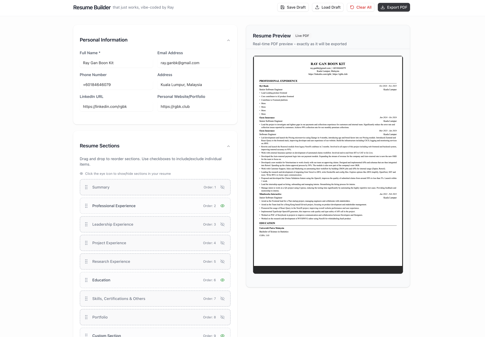

# Ray Resume Editor 📄

> **AI-Powered Professional Resume Builder** - Create stunning resumes with intelligent assistance

A modern, feature-rich resume builder with AI-powered features to help you create professional resumes that stand out. Build beautiful resumes with drag-and-drop functionality, multiple sections, and PDF export.

## 📸 App Preview



_Complete resume builder with real-time PDF preview and AI assistance_

## ✨ Key Features

### 📝 **Complete Resume Builder**

- **8 Resume Sections** - Personal info, summary, experience, education, skills, leadership, projects, research, portfolio
- **Rich Text Editor** - Format descriptions with bold, italic, and bullet lists
- **Smart Date Picker** - Month/year selection with "Present" option
- **QR Code Generation** - Auto-generate QR codes for portfolio links

### 🎛️ **Effortless Organization**

- **Show/Hide Items** - Include/exclude any entry with checkboxes - just keep adding experiences!
- **Drag & Drop Ordering** - Reorder sections and items effortlessly
- **Sort Order Popover** - Bulk reorder items with visual interface to ease your workflow
- **Module System** - Enable/disable entire sections

### 🤖 **AI-Powered Features**

- **Intelligent Chat Interface** - Build your resume through conversation
- **Context-Aware Suggestions** - AI-powered content recommendations
- **Experience Enhancement** - Intelligent description improvements
- **Smart Content Generation** - Auto-generate professional content

### 💾 **Smart Data & Export**

- **Save/Load Drafts** - Export/import your resume as JSON with validation
- **Local Storage** - Automatic saving between sessions
- **PDF Export** - High-quality, print-ready PDFs with customizable styling
- **Real-time Preview** - See changes instantly as you type with live PDF preview
- **Multiple Font Options** - Choose from Times New Roman, modern sans-serif, and monospace fonts
- **Layout Density Control** - Compact or normal spacing for optimal content fit
- **Responsive Design** - Works perfectly on desktop, tablet, and mobile

## 🚀 Getting Started

### Prerequisites

- Node.js 18+ 
- npm or yarn

### Local Development

```bash
# Clone the repository
git clone <repository-url>

# Install dependencies
npm install

# Run the development server
npm run dev
```

Open [http://localhost:3000](http://localhost:3000) with your browser.

## 🏗️ Built With

- **Next.js 15** - React framework with app router
- **TypeScript** - Type safety throughout
- **Tailwind CSS** - Utility-first styling
- **@react-pdf/renderer** - PDF generation
- **@dnd-kit** - Drag and drop functionality
- **Zustand** - State management
- **Tiptap** - Rich text editing
- **AI SDK** - AI-powered features

## 📄 License

This project is proprietary software. All rights reserved.

---

**Ray Resume Editor** - Professional resumes made intelligent 🚀